# Employee Management System Project
This is a group project by Team D of SQL Study Group for an Employee Management System (EMS).

## Overview
The Employee Management System (EMS) is a SQL-based project that simulates how organisations manage employee information within a relational database. The EMS database consists of six relational tables representing employees, departments, job roles, salaries, attendance, and performance.

The goal of the project is to design a structured database schema and use SQL queries to retrieve, filter, and analyse employee-related data.

This project focuses entirely on SQL and relational database design, demonstrating core data management and querying skills used in real HR information systems.

## Problem Statement
Organisations need structured systems to manage employee data efficiently. Without a well-designed database, it becomes difficult to track employee records, analyse performance, monitor attendance, or generate HR reports.

This project addresses that problem by designing a relational Employee Management System database that allows HR teams to:

1. Store employee and department information
2. Track salary history
3. Monitor attendance records
4. Review employee performance
5. Generate HR insights through SQL queries

## Tools Used

Database: MySQL

Editor: MySQL Workbench

Data Source: Google Sheets (CSV) 

## Data Source

The raw data used for this project can be found in the data folder.

The database consists of the following tables:

1. EMPLOYEES - Stores information about each employee.

Fields: EmployeeID, FirstName, LastName, DateOfBirth, Email, HireDate, JobID, DepartmentID, ManagerID, Status

2. DEPARTMENTS - Stores department details.

Fields: DeptID, DeptName, Location

3. JOBS - Stores job roles and salary ranges.

Fields: JobID, JobTitle, MinSalary, MaxSalary

4. SALARIES - Tracks employee salary history.

Fields: SalaryID, EmployeeID, SalaryAmount, FromDate, ToDate

5. ATTENDANCE - Tracks daily attendance of employees.

Fields: AttendanceID, EmployeeID, AttendanceDate, Status, CheckInTime, CheckOutTime

6. PERFORMANCE - Tracks employee performance reviews.

Fields: PerformanceID, EmployeeID, ReviewDate, Rating, Comments

# Database Schema & ER Design

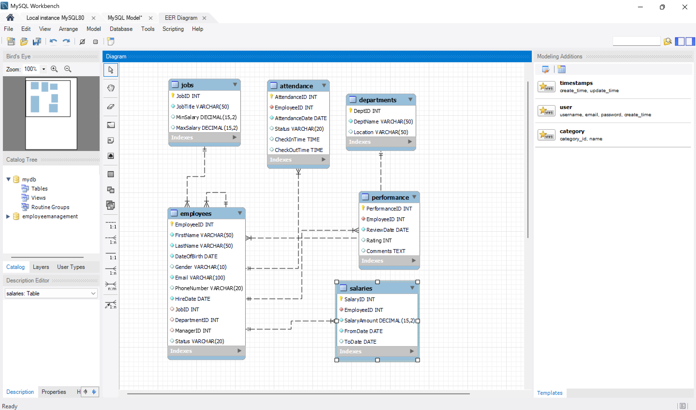

## Methods

Step 1: Database Design

Created the project database and initialised the workspace.

Step 2: Table Creation/Design

Designed and created tables using SQL CREATE TABLE statements with appropriate constraints and relationships. Tables created include: Employees, Departments, Jobs, Salaries, Attendance, Performance

Step 3: Data Exploration 

Queries were used to retrieve and filter employee information and understand the dataset.

Step 4: Data Filtering

Query using comparison and logical operators to simulate how HR identifies performance, trends, and patterns. 

Step 5: Data Organisation

Track top performers, departmental distributions, and generate paginated dashboards.

## Findings

3a. All Employees: Full name & Email

```sql
SELECT CONCAT(FirstName,' ', LastName) AS Full_name, email
FROM employees;
```
There are 285 employees in total.
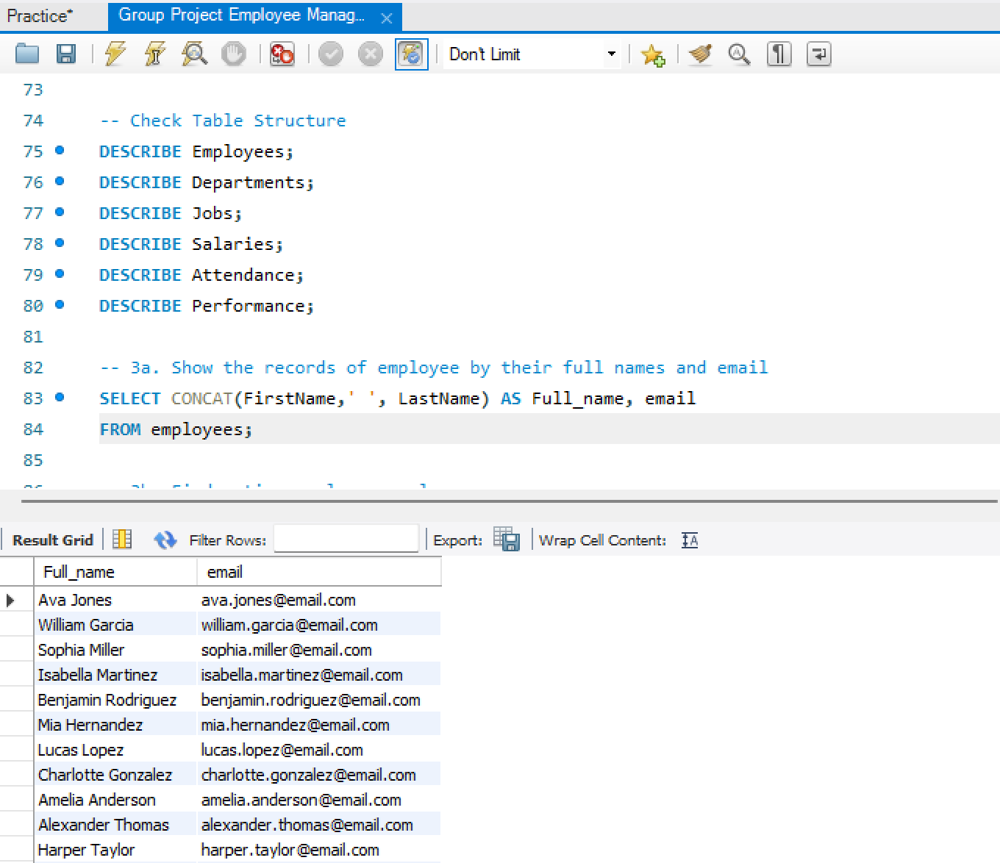
 
3b. Active employees only

```sql
SELECT * FROM employees
WHERE Status = 'Active';
```
There are 238 active employees. 
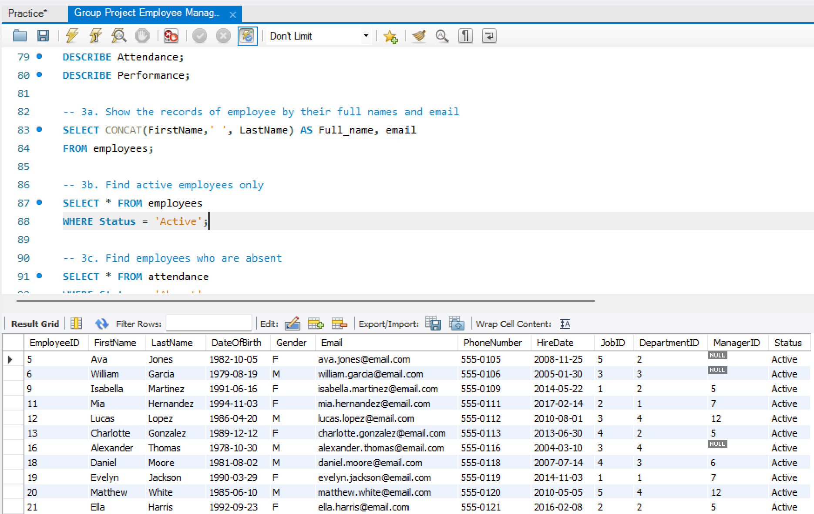

3c. Absent employees

```sql
SELECT * FROM attendance
WHERE Status = 'Absent';
```
There are 24 absent employees.
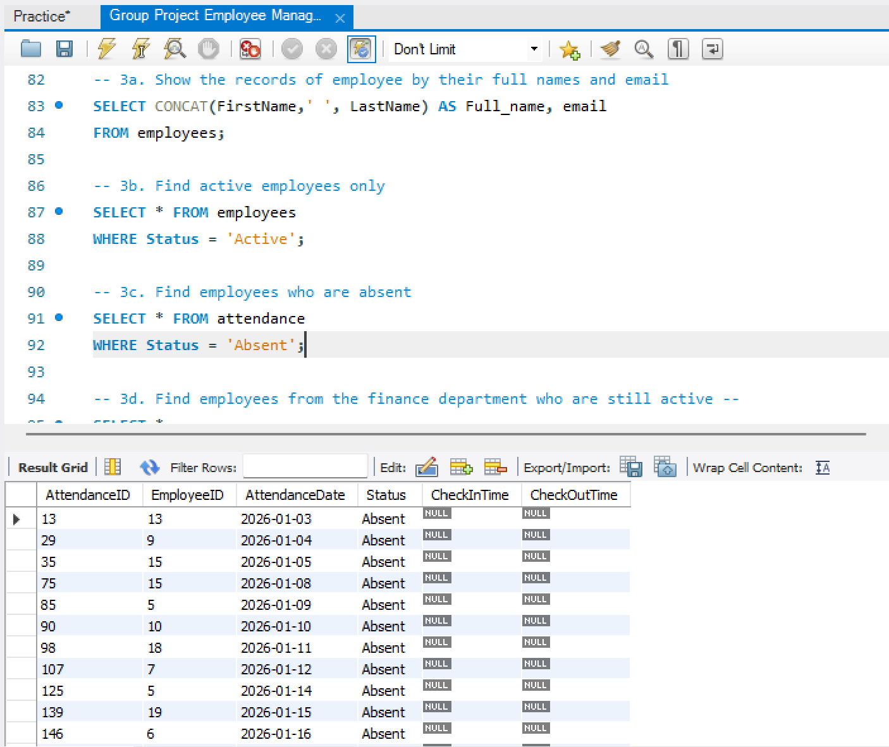

3d. Employees from the finance department who are still active

```sql
SELECT *
FROM employees AS E
JOIN departments AS D
ON D.DeptID = E.DepartmentID
WHERE DeptName = 'Finance' AND Status = 'Active';
```
There are 57 employees in the Finance department, and only 46 are active.
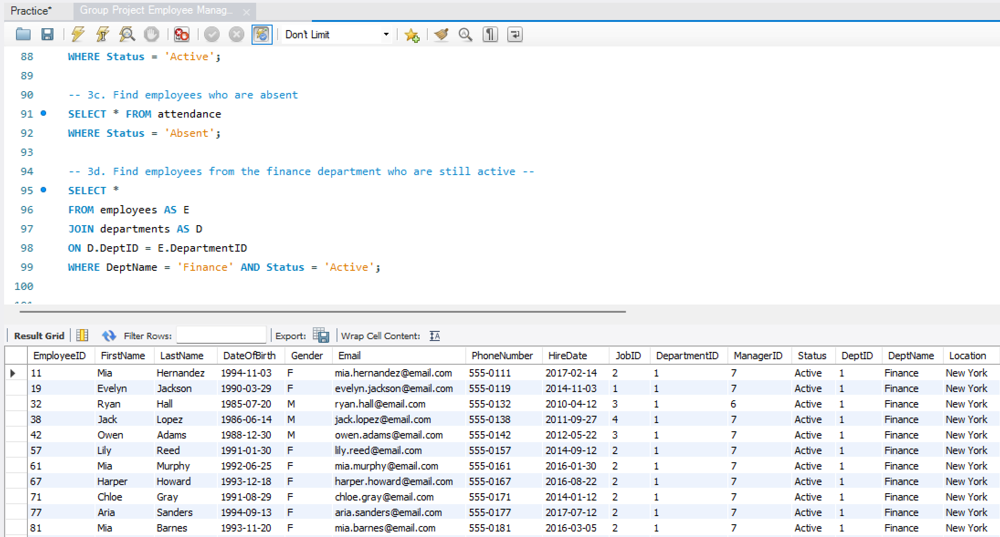

4a. Employee records of those paid above one hundred thousand 

```sql
SELECT *
FROM employees AS E
JOIN salaries AS S
ON E.EmployeeID = S.EmployeeID
WHERE SalaryAmount > 100000;
```
There are 27 employees earning more than 100,000.
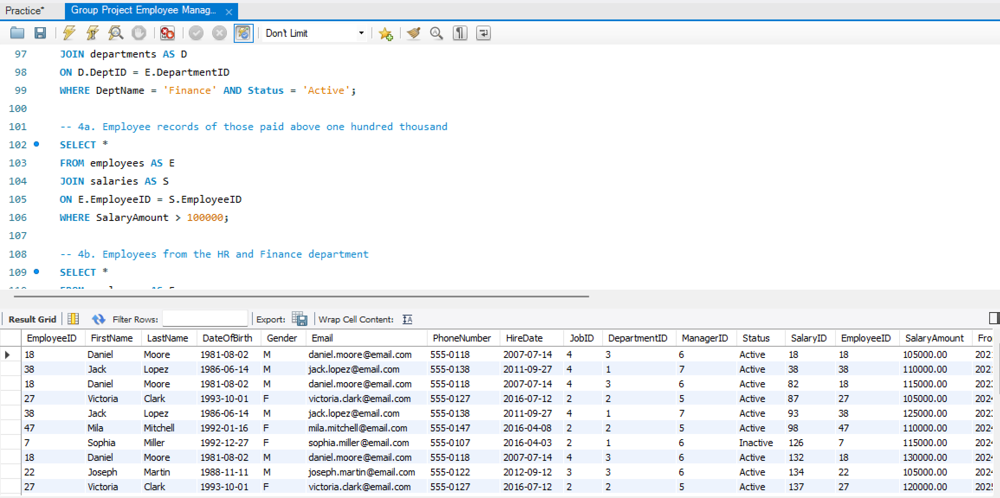

4b. Employees from the HR and Finance department

```sql
SELECT * 
FROM employees AS E
JOIN departments AS D
ON D.DeptID = E.DepartmentID
WHERE DeptName IN ('Finance', 'Human Resources');
```
There are 163 employees in the Finance & Human Resources departments.
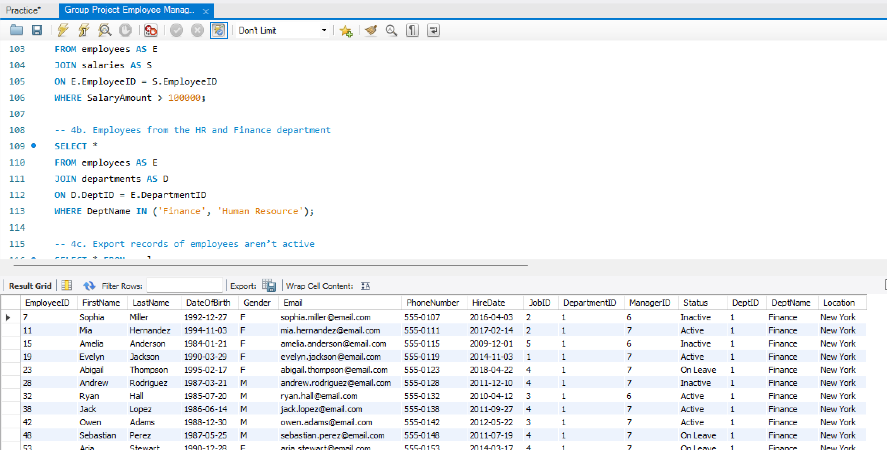

4c. Records of employees aren’t active

```sql
SELECT * FROM employees
WHERE Status = 'Inactive';
```
There are 5 inactive employees. 42 employees however, are on leave.
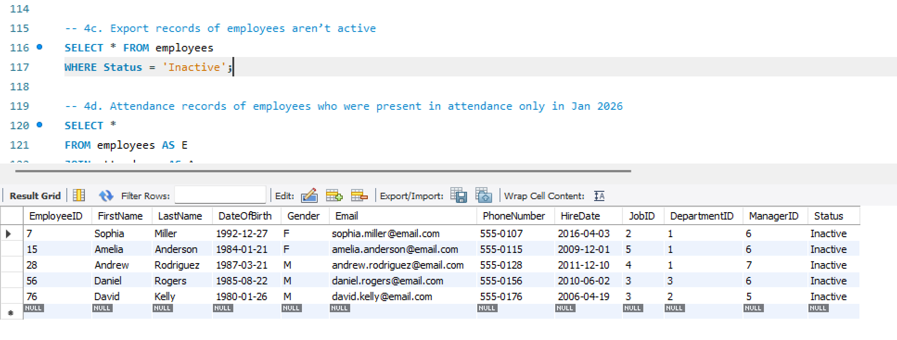

4d. Attendance records of employees who were present in attendance only in Jan 2026

```sql
SELECT * 
FROM employees AS E
JOIN attendance AS A
ON E.EmployeeID = A.EmployeeID
WHERE A.AttendanceDate LIKE '2026-01-%'
AND A.Status = 'Present';
```
There were 163 employees present in attendance only in Jan 2026.
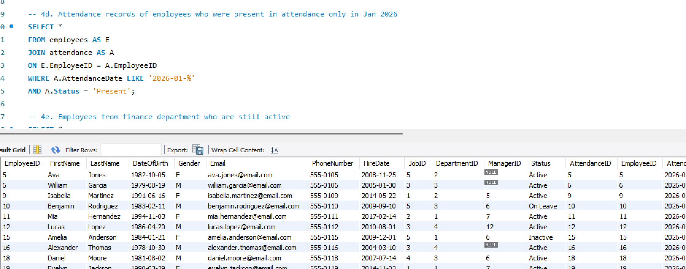

4e. Employees from finance department who are still active

```sql
SELECT *
FROM employees AS E
JOIN departments AS D
ON D.DeptID = E.DepartmentID
WHERE DeptName = 'Finance' AND Status = 'Active';
```
There are 57 employees in the Finance department, and only 46 are active.
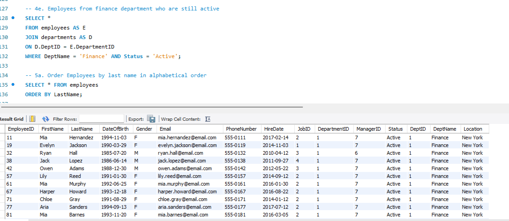

5a. Order Employees by last name in alphabetical order

```sql
SELECT * FROM employees
ORDER BY LastName;
```
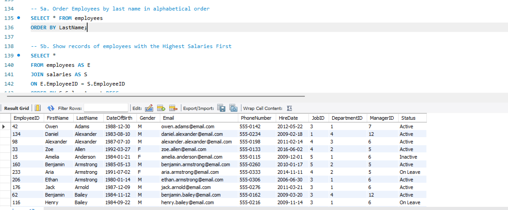

5b. Show records of employees with the Highest Salaries First

```sql
SELECT * 
FROM employees AS E
JOIN salaries AS S
ON E.EmployeeID = S.EmployeeID
ORDER BY S.SalaryAmount DESC;
```
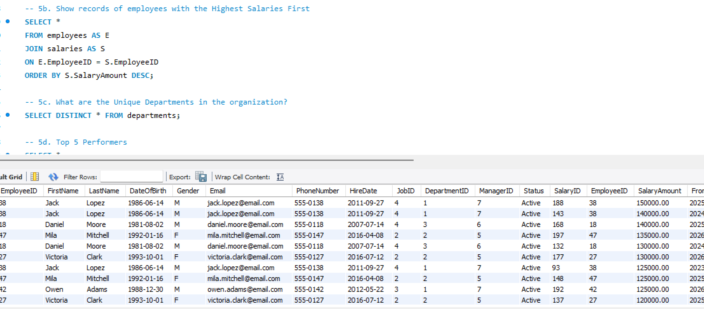


5c. Unique Departments in the organisation

```sql
SELECT DISTINCT DeptName AS Unique_Depts
FROM departments;
```
There are 285 unique departments in the organisation. Only 4 are in use.
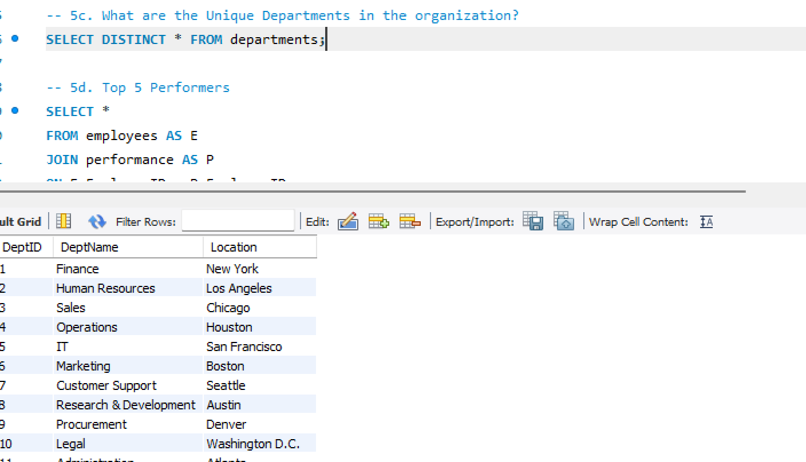

5d. Top 5 Performers

```sql
SELECT * 
FROM employees AS E
JOIN performance AS P 
ON E.EmployeeID = P.EmployeeID
ORDER BY Rating DESC
LIMIT 0,5;
```
The top 5 performers were female data analysts, 2 in the Finance department and 1 in the Human Resources department.
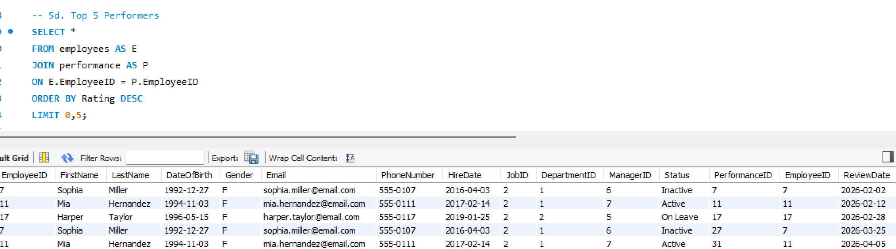

5e. Next 5 Employees (Pagination)

```sql
SELECT * 
FROM employees AS E
JOIN performance AS P 
ON E.EmployeeID = P.EmployeeID
ORDER BY Rating DESC
LIMIT 5,5;
```
The next 5 (6-10) were the same 3 women: Sophia Miller, Mia Hernandez and Harper Taylor.
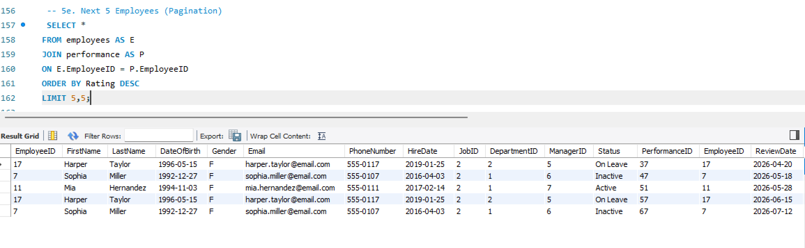

### Additional Analysis

1. Employees per Department
```sql
SELECT D.DeptName, COUNT(E.EmployeeID) AS Employee_Count
FROM Employees E
JOIN Departments D
ON E.DepartmentID = D.DeptID
GROUP BY D.DeptName
ORDER BY Employee_Count DESC;
```
There are 106 in HR, 62 in operations, 60 in Sales & 57 in Finance.
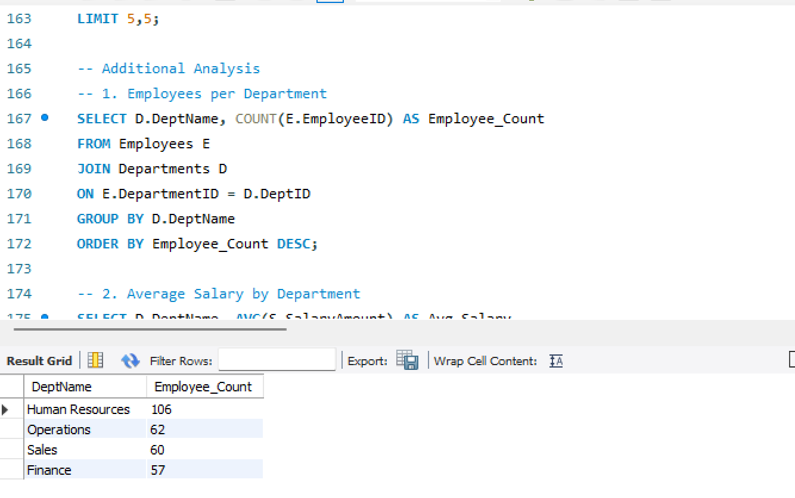


2. Average Salary by Department
```sql
SELECT D.DeptName, AVG(S.SalaryAmount) AS Avg_Salary
FROM Employees E
JOIN Salaries S ON E.EmployeeID = S.EmployeeID
JOIN Departments D ON E.DepartmentID = D.DeptID
GROUP BY D.DeptName
ORDER BY Avg_Salary DESC;
```
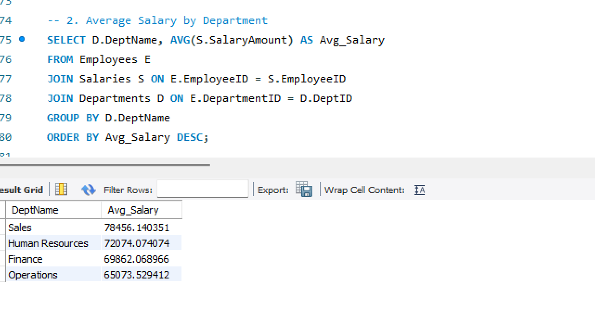

3. Performance Rating Distribution
```sql
SELECT Rating, COUNT(*) AS Number_of_Employees
FROM Performance
GROUP BY Rating
ORDER BY Rating DESC;
```
This shows how employee performance ratings are distributed across the organization and helps identify performance trends.
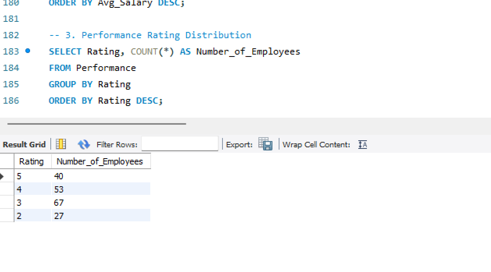

## Recommendations
-- i. Monitor workforce status regularly to manage inactive employees and staff currently on leave.

-- ii. Review employee distribution across departments, particularly Finance and Human Resources where a large share of employees are concentrated.

-- iii. Conduct periodic salary reviews to ensure compensation remains fair.

-- iv. Improve attendance tracking systems to identify absenteeism trends and support better workforce accountability.

-- v. Recognize high-performing employees through incentives, promotions, or professional development opportunities to improve retention and productivity.
